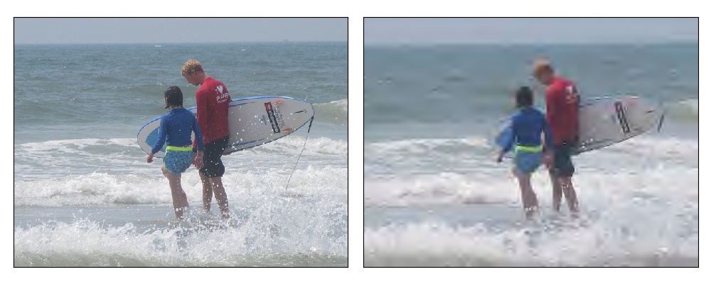
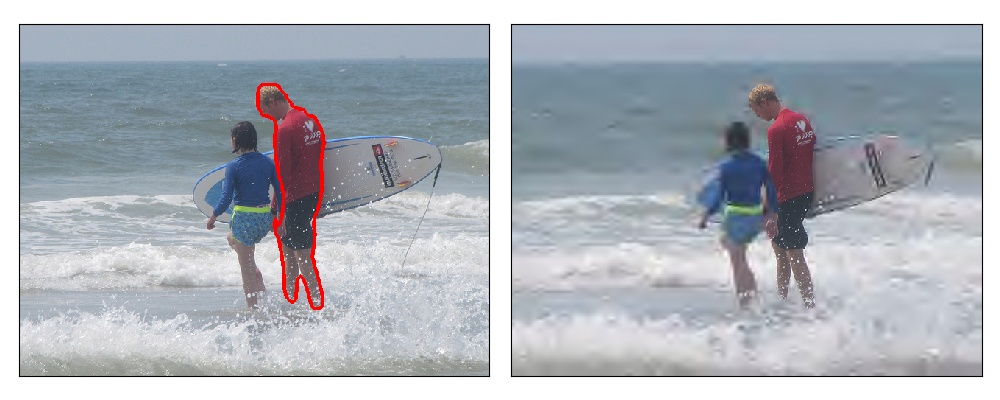

# 画像中の重要領域に関するアンケート２

## 目的

動画像は情報伝達手段として広く用いられていますが，容量が大きいということが問題となっています．

現在主流の符号化手法は一様圧縮ですが，これは高圧縮時に重要領域が欠損する場合があります．

また，画像中の重要領域の品質を維持したまま圧縮すること（ROI符号化）ができれば効率が良いと考えられます．

そこで，画像中の重要領域はどこかを定義するために本アンケートを実施します．

## 内容

本アンケートではROI符号化におけるROIを変えた際の品質についての調査を行います．

一般にROIを増やすとそれだけ画像の品質は良くなりますが，容量が大きくなります．

そこで，画像の意味を把握する上で必要なROIを以下の手順で設定していただきます．

## 準備

SSHでは画像が表示されない場合があるので，ローカルでの実行を推奨します．

このプログラムはpython3で動きます．

まず，以下のコマンドでこのリポジトリをダウンロードしてください．

```
$ git clone https://github.com/suzu-taku/questionnaire2.git
```

次に，"questionnaire2"に移動して以下のコマンドでパッケージ（OpenCV, matplotlib, numpy, Pillow）をインストールしてください．

（前回作成していただいた環境で動作します．）

```
$ cd questionnaire2
$ pip install -r requirements.txt
```

## 実行

準備ができたら，コマンドライン引数に問題番号を指定して"main.py"を実行してください．

```
$ python main.py 問題番号
```

実行すると，まず以下の画面および文字列が出力されます．



```
This is the picture No.001 / 060.
------------------------------------------
image   1 /  60, number of ROI   0 /   3
------------------------------------------
 n : Increase the number of ROI
 b : Decrease the number of ROI
 e : This number of ROI is the best
------------------------------------------
Your answer >>
```

左側にはオリジナル画像，右側には圧縮された画像が表示されます．

```
image   1 /  60, number of ROI   0 /   3
```

imageは現在の画像の番号，number of ROIは右側の画像中のROIの数を示しています．（ROIの数は最初は0です．）

ここで，
ROIを増やしたい（右側も画像だけでは分からない）：n
ROIを減らしたい（右側の画像のROIは冗長）：b
ROIがちょうど良い（右側の画像で意味が分かる）：e

を入力してください．

「n」および「b」を入力すると，その内容が反映された画像が再び表示されます．



右側の画像で中央の男性の解像度が上がっている様子が分かると思います．

「e」を入力するとその画像のROIが確定され，次の画像に進みます．

## 提出

全ての画像について回答すると，"results.pickle"が生成されます．

これを以下のリンクに送信してください．

https://www.dropbox.com/request/YuiPhxZhZH4NokBZqJ09


