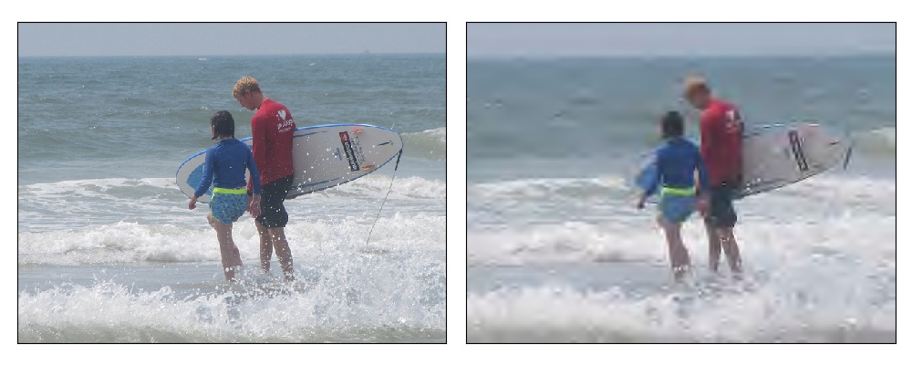
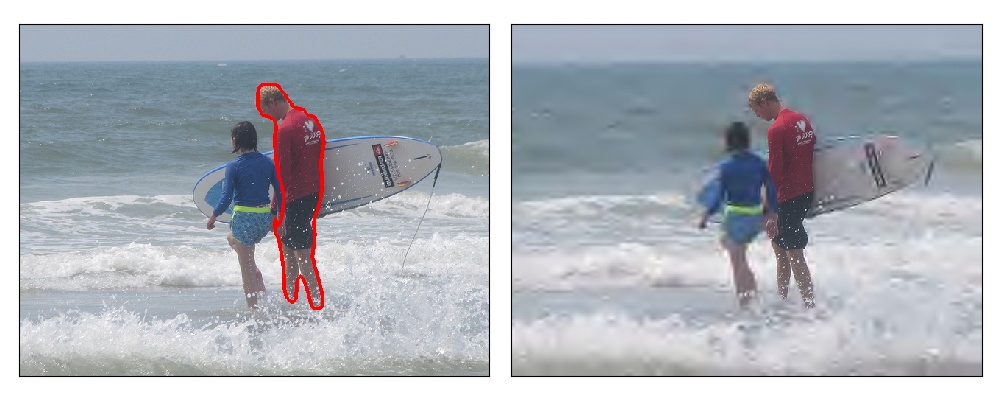

# Questionnaire 2 on important regions in images

## Purpose

Movies and images are widely used as a means of information communication, but these opress capacity for channels.

Uniform compression is current popular method but may cause loss of important regions when high compressed.

So image compression without loss of important regions, which is known as ROI coding, is needed.

That's why we need to know where are important regions in images.

## Content

In this questionnaire, we will investigate the quality when ROI is changed in ROI coding.

Generally, the more ROI, the better the image quality, but the larger the size.

Therefore, set the ROI, which is necessary to understand the meaning of the image, by the following procedure.

ROI (Region Of Interest) is the region where quality is maintained during compression.

## Installation

Python 3.0+ is required.

Download this repository like this:

```
$ git clone https://github.com/suzu-taku/questionnaire2.git
```

Install all the python dependencies (OpenCV, matplotlib>=3.0.0, numpy, Pillow) using pip.

```
$ cd questionnaire
$ pip install -r requirements.txt
```

## Execution

Run "main.py" with your questionnaire ID.

```
$ python main.py questionnaire_ID
```

Following image and words are output after running.



```
This is the picture No.001 / 060.
------------------------------------------
image   1 /  60, number of ROI   0 /   3
------------------------------------------
 n : Increase the number of ROI
 b : Decrease the number of ROI
 e : This number of ROI is the best
 i : Interrupt and save now state
------------------------------------------
Your answer >>
```

Left: original image, Right: compressed image

If you want to increase the number of ROI (can't understand the meaning of the right image)　-> input "n"

If you want to decrease the number of ROI (ROI in the right image is redundant) -> input "b"
                 
If the number of ROI is best -> input "e"
                 
If you want to interrupt this questionnaire and save now state -> input "i"

When you input "n" or "b", the image that reflects the contents is displayed.



As you can see in the right image, the resolution of the man in the center is increasing.

The area surrounded by red in the left image shows the current ROI.


## Submission

After completing the questionnaire, please submit the "result_ID.pickle" to following URL.

https://www.dropbox.com/request/YuiPhxZhZH4NokBZqJ09
